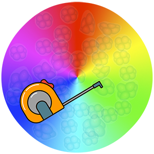

<!-- Set the style of body text -->

<!-- README.md is generated from README.Rmd. Please edit that file -->

# AutoClone 

<!-- badges: start -->

<!-- badges: end -->

## Overview

`AutoClone` is a shiny app for the automatic assessment of clonality
based on the data generated through genetic cell labelling and lineage
tracing assays. The AutoClone app includes three major modes relevant to
the input data. The clonality assessment is a technique used to evaluate
the similarity of cells/fibres generated through a biological process or
through development. This technique can also be used for lineage tracing
of cells/fibres during development. There are several methods for
performing these analyses most of which rely on genetic cell labelling
and coloring of the cells. One of the important aspects of
labelling-based lineage tracing and clonal analysis is the
quantification and statistical evaluation of the results
(i.e. converting visual colors to interpretable statistics). The
`AutoClone` app makes it possible for you to automatically perform these
quantifications and statistical analyses.

## Author

The `AutoClone` was developed by [Adrian (Abbas)
Salavaty](https://www.abbassalavaty.com/)

## Advisor

Peter D. Currie

## Shiny app

-   [AutoClone Shiny Dashboard](https://autoclone.erc.monash.edu/)

## How to cite `AutoClone`

To cite `AutoClone`, please cite its Zenodo DOI:

-   Integrated Value of Influence: An Integrative Method for the
    Identification of the Most Influential Nodes within Networks. Abbas
    Salavaty, Mirana Ramialison, Peter D Currie. *Patterns*. 2020.08.14
    ([Read online](https://doi.org/10.1016/j.patter.2020.100052)).

## How to contribute

Please don’t hesitate to report any bugs/issues and request for
enhancement or any other contributions. To submit a bug report or
enhancement request, please use the [`AutoClone` GitHub issues
tracker](https://github.com/asalavaty/AutoClone/issues).
